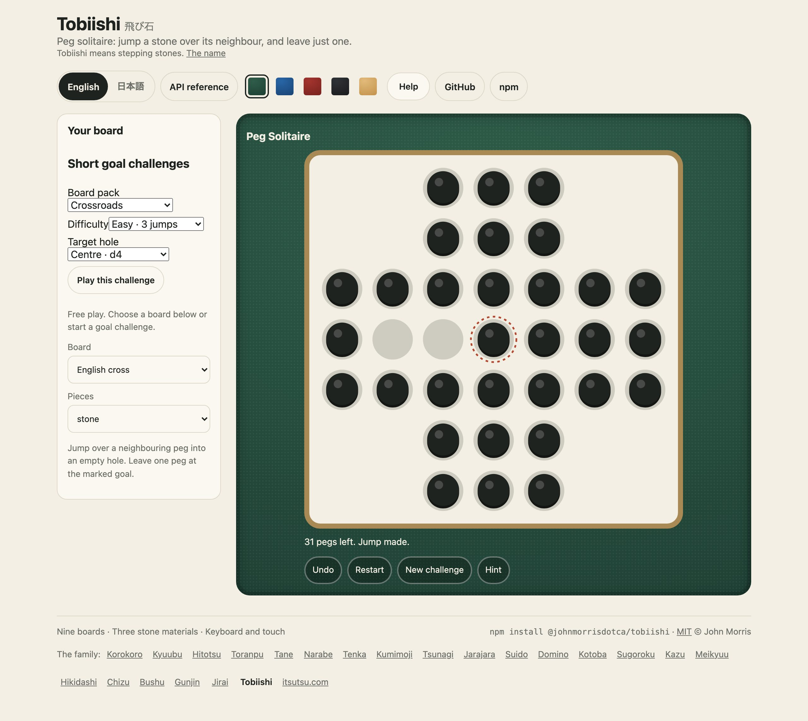
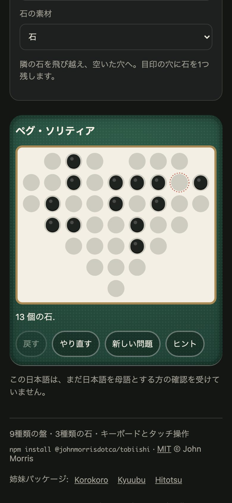

<h1 align="center">Tobiishi <sub>飛び石</sub></h1>

<p align="center"><strong>Peg solitaire on classic boards and playful shapes.</strong><br>
Nine outlines, custom rectangles, seeded solvable challenges and accessible English/Japanese play. No runtime dependencies.</p>

<p align="center">
  <a href="https://github.com/johnmorrisdotca/tobiishi/actions/workflows/ci.yml"></a>
  <a href="https://www.npmjs.com/package/@johnmorrisdotca/tobiishi"></a>
  <a href="./LICENSE"></a>
  
  
</p>

<p align="center"><a href="https://johnmorrisdotca.github.io/tobiishi/"><strong>Play a board →</strong></a> · <a href="https://johnmorrisdotca.github.io/tobiishi/api.html">API reference</a></p>

<p align="center">
  
  
</p>

## Who it is for

- Puzzle sites that need a playable board and an immutable rules engine.
- Teachers exploring jumps, board geometry and solvability.
- Players who enjoy classic crosses, triangles, hearts, stars and short goal challenges.

Peg solitaire for JavaScript and TypeScript. Jump one peg over another into an
empty hole. Remove the jumped peg. Leave one peg in the dotted goal hole.

A pure immutable engine, custom boards, SVG drawing, and English/Japanese play.
Zero runtime dependencies. Node 22+ for development; modern browsers for play.
The Japanese name means stepping stones; it is a project name rather than a
claim about the game's historical Japanese name.

## Boards

- **English cross:** the traditional 33-hole board, empty centre, finish at centre.
- **Triangle:** the classic 15-hole triangular lattice, empty apex; finish in any hole. Six jump directions.
- **European:** a 37-hole board; seeded challenges with a specified final hole.
- **Diamond:** a compact 25-hole board; seeded challenges.
- **Heart:** a 40-hole heart outline on a square lattice; generated partial challenges.
- **Star:** a 49-hole star outline on a square lattice; generated partial challenges.
- **Hexagon:** a 37-hole hexagonal outline on a triangular lattice; six jump directions and generated partial challenges.
- **Wide:** a 9 × 5 rectangle; generated partial challenges.
- **Tall:** a 5 × 9 rectangle; generated partial challenges.

`rectangleBoard(width, height)` supplies other square-lattice rectangles (at least
3 holes per side, at most 32 per side and 128 holes overall). Pass its result to
`generate` and supply the returned challenge to the player. `makeBoard` also
supports custom integer-coordinate outlines; the SVG bounds follow their geometry.

All modes other than the two classic starts begin with a partial board, generated backward from
one peg. Each includes an independently replayable answer. They do **not** claim
to reproduce every traditional single-vacancy start. In particular, the European
centre-vacancy/centre-finish problem is impossible under ordinary orthogonal rules.
A requested challenge length is a maximum; if backward growth stalls, the best
of 160 deterministic attempts is returned. Inspect `answer.length` for actual length.

## Install and play

```sh
npm install @johnmorrisdotca/tobiishi
```

```ts
import { mount } from '@johnmorrisdotca/tobiishi/play';
const player = mount(document.querySelector('#game')!, {
  shape: 'english', language: 'en', material: 'stone',
  onChange(game, code) { localStorage.setItem('tobiishi', code); }
});
// player.getGame(), player.setGame(game), player.destroy()
```

A `game` overrides the initial position; a `challenge` supplies both game and
proof for instant hints along its answer. Configure `shape`, `seed`, `language`,
`material` (`stone`, `wood`, `glass`), partial `theme`, `challengeJumps`, or `justBoard`.
New challenge grows a fresh proved position on the selected board, including the
English and triangular shapes; its requested length defaults to twelve jumps. Just-board
mode retains the board and live status; host controls can call `setGame` with
`undo`, `restart`, or a new game. The engine has no automatic persistence or telemetry; the demo saves its selected pack and current game to local storage on this device.

### Short goal challenge packs

The demo also has nine named board packs, one for each built-in shape. Each pack
offers three distinct target holes and three short levels: 3, 6, or 9 jumps.
Choose the board pack, difficulty, and target hole before starting. Every one of
the 81 combinations has a deterministic original starting layout and a complete
legal witness sequence; the built-in Hint follows that witness. Difficulty here
means the length of the witness, not a claim about solving skill. Challenge saves
keep the selected pack, goal, difficulty, current game and assisted flag on the
device. Sharing the challenge URL restores the named starting challenge.

```ts
import { generateTobiishiChallenge } from '@johnmorrisdotca/tobiishi';

const challenge = generateTobiishiChallenge('wide', 'north', 'medium');
// challenge.game.target names the North lane; challenge.answer has six legal jumps.
```

The pack definitions are in `src/challenges.ts`; tests replay every witness and
check that its final peg occupies the selected hole.

## Engine

```ts
import { classicEnglish, jumpAt, legalJumps, undo,
  gameCode, gameFromCode, isGameSolved, solve,
  makeBoard, newGame, generate } from '@johnmorrisdotca/tobiishi';
let game = classicEnglish().game;
const jump = legalJumps(game)[0]!;
game = jumpAt(game, jump.from, jump.to);
game = undo(game);
const restored = gameFromCode(gameCode(game));
const result = solve(game, 100000); // solved | impossible | limit
```

Cells are integer `(x,y)` coordinates. Square boards use horizontal/vertical
jumps. Triangular boards also permit `(1,1)` and `(-1,-1)`; drawing maps these
to an equilateral lattice. A jump crosses exactly one existing hole.
`makeBoard(name, cells, lattice)` creates validated frozen geometry;
`newGame(board, booleanPegs, target)` copies and freezes pieces. Null target
accepts any last hole. Every successful move produces a new game; illegal moves
return the original reference. Save format version 1 rebuilds the board and
replays legal moves, rejecting an invalid history. Saves do not authenticate
scores and are not an anti-cheat protocol. `game.helped` becomes true only when
the built-in player shows a proved hint, survives moves, undo and saved-game
restoration, and resets on restart or a new challenge. The hint emits `onChange`
so a host can persist this field and apply its assisted-scoring policy. Legacy
version-1 saves without `helped` restore as false. Hosts supplying their own
proved hints can call `markHelped(game)` and `player.setGame` explicitly.

`solve` is synchronous and bounded. Large positions can reach the limit and
should be solved in a worker for generous budgets. `limit` is not an assertion
that a position is impossible. No optimality or unique-solution claim is made.

## Draw and custom element

```ts
import { draw } from '@johnmorrisdotca/tobiishi/draw';
const svg = draw(game, { material: 'wood', title: 'My board' });
```

```html
<script type="module">
  import '@johnmorrisdotca/tobiishi/element/define';
</script>
<tobiishi-game shape="triangle" seed="today" language="ja"></tobiishi-game>
```

Or import `defineTobiishi` from `/element` and register an explicit tag.
The element dispatches `tobiishi-change` with the immutable game in `detail`.
Changing its attributes starts a new player. Each vanilla mount owns its DOM
and can be cleaned up independently. The core and draw entries do not access
the DOM, so server rendering and workers can import them safely.

React and other frameworks can use the vanilla API without an adapter dependency:
mount into a ref from an effect and return `player.destroy` as cleanup. Keep
state and language changes explicit through the host or recreate the mount.

## Development

```sh
pnpm install --frozen-lockfile
pnpm check
pnpm exec playwright install chromium
pnpm test:browser
pnpm demo
npm pack --dry-run
```

[Public demo](https://johnmorrisdotca.github.io/tobiishi/). Local development uses port 6718. The demo reuses the byte-identical family.css and
family-template.mjs from the existing packages: shared header, footer, language
pills, cloth swatches and Help switch. The demo links its GitHub repository, npm package and source-derived API reference.
The stone board uses the family ivory/ink/accent palette and brass frame; wood
and glass keep their own piece materials. `PORT` can override it. Keyboard: Tab into the board,
arrow keys move focus through holes in reading order, Enter/Space select, Escape
clears selection. Empty destinations for the selected peg are outlined. Mouse
and touch share the same controls; the interface has no drag requirement.

## Design references

[Simon Tatham's Pegs](https://www.chiark.greenend.org.uk/~sgtatham/puzzles/doc/pegs.html)
provides a useful benchmark for configurable boards and guaranteed solvability.
[George Bell's research](https://www.gibell.net/pegsolitaire/) and
[triangular boards](https://www.gibell.net/pegsolitaire/tindex.html) explain board
geometry, position classes, and the distinction between jumps and multi-jump moves.
The English witness is the mathematical move sequence of Ernest Bergholt's 1912
solution, also described by [Bell](https://www.gibell.net/pegsolitaire/English/index.html).
It is checked by replay, not treated as trusted executable code. No implementation,
artwork, or level collection from these projects has been copied.

## Licence

[MIT](LICENSE) · Copyright 2026 John Morris. The original board drawings and interface ship under the same licence.

The demo places labelled board and piece settings beside the felt panel, matching the Jirai and Kazu demos. `mount(host, { settingsHost })` optionally places these settings in a separate host; action controls remain with the board.

## API reference

The [complete API reference](https://johnmorrisdotca.github.io/tobiishi/api.html) is built from every package entry and its source signatures. The [API guide](docs/API.md) explains the engine, drawing, player and browser tag.

| Entry | Purpose |
| --- | --- |
| `@johnmorrisdotca/tobiishi` | Boards, immutable play, challenges, solving and progress codes |
| `/draw` | SVG drawing and board geometry |
| `/play` | Touch, mouse and keyboard player |
| `/element` | Custom element class and registration function |
| `/element/define` | Browser-only automatic element registration |

## Contributing and security

See [Contributing](CONTRIBUTING.md), the [Code of Conduct](CODE_OF_CONDUCT.md) and the [Security policy](SECURITY.md).

## The family

Tobiishi is made for [Itsutsu](https://itsutsu.com), alongside [Kyuubu](https://github.com/johnmorrisdotca/kyuubu), [Kazu](https://github.com/johnmorrisdotca/kazu), [Jirai](https://github.com/johnmorrisdotca/jirai) and [Gunjin](https://github.com/johnmorrisdotca/gunjin). Their demos share one stylesheet, header, footer and colour palette.
